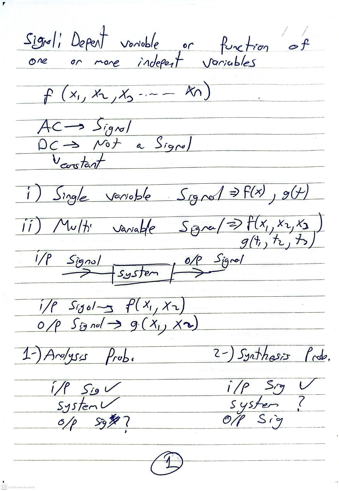
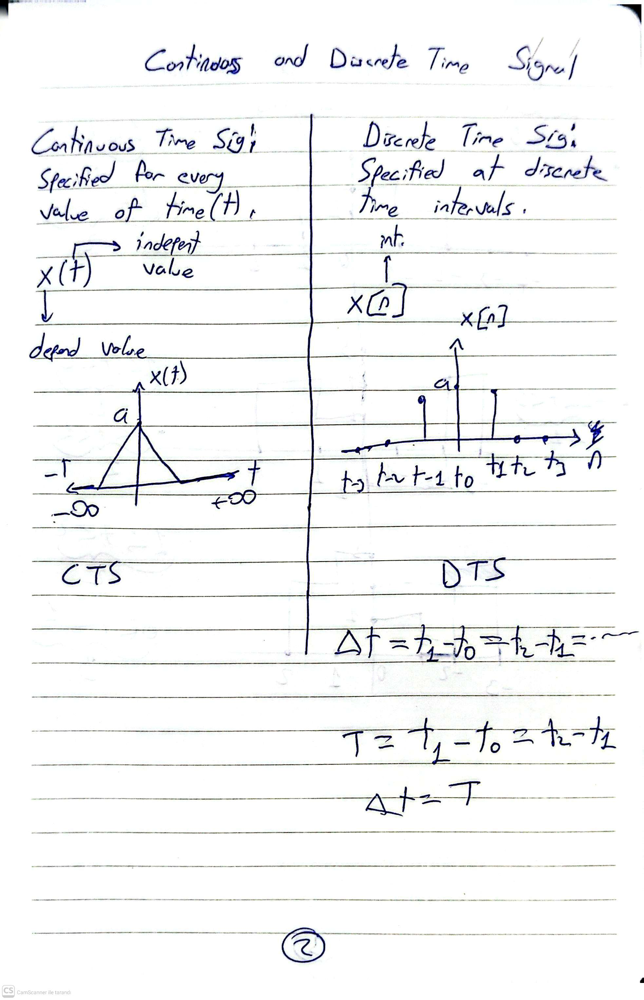
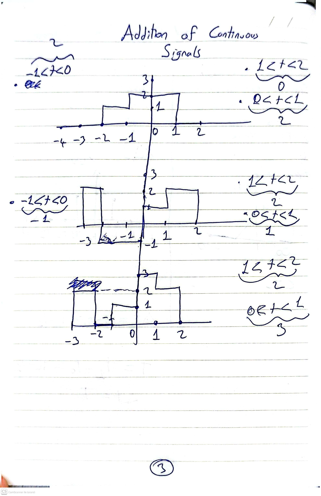
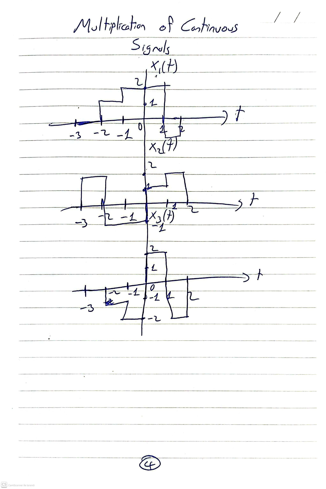

# Hafta 01 · Gün 1 — Sinyaller ve Sistemlere Giriş

**Faz:** Faz 01
**Bugünkü hedef:** Sürekli/ayrık sinyal, LTI sistem kavramları — okuma + repo Hafta 1 not defterini incele.
**Planlanan süre:** 1.5 sa
**Tarih:**

## Yapılanlar
-

## Fotoğraflar
<!-- el defteri sayfalarını gorseller/ klasörüne at,  şeklinde ekle -->

## Öğrenilenler
-

## Sorunlar / takıldığım yerler
-

## Sonraki adım
-

**Commit:** `git commit -m "hafta01-gun1: <özet>"`
